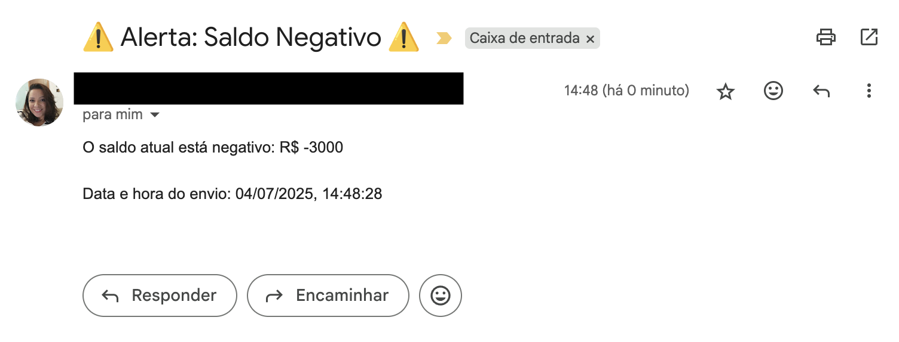

# email-sheets-automation

Projeto para envio automatizado de e-mails com Google Apps Script

## 📢 Alerta de Saldo Negativo com Google Apps Script

Este script envia um e-mail automático caso o saldo registrado em uma planilha esteja negativo. Ideal para controle simples de fluxo de caixa pessoal ou de pequenos negócios.

## 📌 Como funciona

- Lê o saldo da célula `B4` e o e-mail do destinatário da célula `B8`, na aba `Alerta`
- Se o saldo for menor que zero, envia um e-mail com alerta e data/hora
- Exibe uma mensagem na tela confirmando o envio ou informando que o saldo está positivo

## 🚀 Como usar

1. Crie uma planilha com a aba chamada `Alerta`
2. Insira o saldo na célula `B4` e o e-mail de destino em `B8`
3. Copie o código para um projeto do [Google Apps Script](https://script.google.com)
4. Execute a função `enviarAlertaEmail()` manualmente ou crie um gatilho automático

## 📎 Requisitos

- Conta Google com acesso ao Google Sheets e Gmail
- Permitir as autorizações de envio de e-mail no primeiro uso do script
- O envio de e-mails está sujeito aos limites diários do Gmail (ex: 100/dia para contas gratuitas)

📌 Consulte os limites oficiais aqui:  
https://developers.google.com/apps-script/guides/services/quotas

## 🖼️ Exemplo de e-mail recebido

---

📝 Licença: MIT
